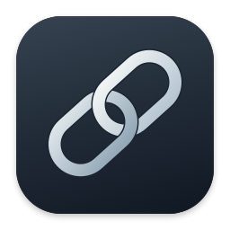

<h1 align="center">이음 · Ieum</h1>

by dicass

Mac 사이의 입력과 자료를 이어 주는 도구

<a href="https://github.com/dicass/ieum/releases/latest">최신 버전 다운로드</a> · <a href="USER_GUIDE.md">사용설명서</a> · <a href="CHANGELOG.md">변경 내역</a> · <a href="SUPPORT.md">문제 해결</a>

**최신 버전 0.11.17 · macOS 14 이상 · Apple Silicon**

원격 Mac을 쓰면서 한영 전환이 헷갈리거나, 복사한 자료와 파일을 여러 Mac에서 이어 쓰고 싶을 때 이음을 사용해 보세요. 클립보드 보관, 단축키 안내, 글자 추출처럼 Mac 한 대에서도 쓸 수 있는 기능이 있습니다. 필요한 기능만 켜서 사용할 수 있어요.

## 이음으로 할 수 있는 일

| 기능 | 이렇게 쓰세요 |
| --- | --- |
| 한영 전환 | Caps Lock으로 빠르게 전환하고, 원격 앱마다 입력 상태를 동기화하거나 상대 Mac의 언어를 고정합니다. |
| 원격 단축키 | 활성 원격 창에서 기본 동작 유지·원격 우선·로컬 우선과 단축키별 예외를 정합니다. |
| 단축키 안내 | 클릭한 기능의 단축키를 확인하고, 한눈에 보기에서 검색·충돌 검사·빈 조합 추천을 사용합니다. |
| 클립보드·창고 | 복사 기록을 찾거나 텍스트·이미지·파일을 골라 보관합니다. 파일은 원본 링크와 사본 중에서 선택합니다. |
| 여러 Mac으로 보내기 | Finder·창고·클립보드에서 받을 Mac을 여러 대 고르고, Mac마다 저장 위치를 지정합니다. 전송 일시정지와 이어보내기를 지원합니다. |
| 글자 추출 | 화면의 필요한 영역이나 이미지에서 글자를 읽어 복사합니다. |
| 잠자기 관리 | 시간 지정·무제한·조건별 잠자기 방지와 등록한 Mac 깨우기를 사용합니다. |
| 디스플레이 관리 | 여러 모니터를 함께 보며 지원하는 밝기·음량·입력을 조절하고, 프리셋과 화면 배치를 저장합니다. |

원격 화면 연결은 사용하던 원격 데스크톱 앱을 이용하고, 이음에서 입력 규칙과 자료 공유를 설정합니다.

## 처음 설치하기

1. [최신 설치 파일 — Ieum-0.11.17.dmg](https://github.com/dicass/ieum/releases/download/v0.11.17/Ieum-0.11.17.dmg)을 받습니다.
2. DMG를 열고 이음 아이콘을 **Applications** 폴더로 끌어다 놓습니다.
3. 복사가 끝나면 **응용 프로그램** 폴더에서 이음을 실행합니다.
4. 사용할 기능을 켜고, 그 기능에 필요한 권한을 허용합니다.

기존 앱을 DMG로 바꿀 때는 진행 중인 전송을 마치고 이음을 먼저 종료해 주세요. DMG 안의 앱을 계속 실행하지 말고 응용 프로그램 폴더에 설치해 사용하세요.

현재 배포 파일은 **Apple Silicon Mac용**입니다. Intel Mac용 빌드는 제공하지 않습니다. 배포 앱은 Developer ID로 서명하고 Apple 공증을 거칩니다. 파일의 SHA-256은 각 릴리스 설명과 `SHA256SUMS.txt`에서 확인할 수 있습니다.

## 어떤 권한이 필요한가요?

| 권한 | 필요한 기능 |
| --- | --- |
| 손쉬운 사용 | 한영 전환 키 제어, 다른 앱의 단축키 읽기·입력·붙여넣기 |
| 화면 기록 | 화면 영역에서 글자 추출. 이미지 파일만 읽을 때는 필요하지 않습니다. |
| 로컬 네트워크 | 다른 Mac 찾기·연결·자료 공유 |
| Finder 확장 | Finder 우클릭 메뉴에서 창고에 담기·다른 Mac으로 보내기 |

권한은 사용하는 Mac마다 허용해야 합니다. 설정을 동기화해도 macOS 권한까지 옮겨지지는 않아요. 자세한 순서는 [사용설명서](USER_GUIDE.md)에 있습니다.

## 다른 Mac과 함께 쓰기

양쪽 Mac에 이음을 설치하고 **한영 전환 → 연결 기기**에서 상대를 추가하세요. 상대 Mac의 승인을 받아 연결한 뒤 공유 기능과 받을 폴더를 정합니다. 여러 Mac으로 파일을 보낼 때는 받는 Mac마다 연결과 폴더 허용이 필요합니다.

VPN을 사용한다면 VPN 연결도 먼저 확인해 주세요. 파일 전송의 연결 인증 시간 초과는 상대 Mac의 이음 실행 여부와 네트워크 연결부터 확인하면 좋습니다.

원격 단축키 전달은 양쪽의 입력 제어와 상대 Mac의 **단축키 받기** 허용이 필요합니다. 일반 앱 단축키를 중심으로 처리하며, 일부 시스템 단축키는 macOS와 원격 앱의 설정을 따릅니다. 단축키 안내 범위와 모니터 조절·깨우기 지원 여부도 앱·기기·연결 환경에 따라 달라집니다.

## 다음 버전은 앱에서 받으세요

0.11.15부터 메뉴바 아이콘 우클릭 → **업데이트 확인…**, 또는 **일반 → 일반 → 업데이트**에서 새 버전을 설치할 수 있습니다. 기본값은 자동 확인이며 설치 전에 알려드립니다. 미리 다운로드하고 종료할 때 설치하도록 바꿀 수도 있습니다.

파일 전송이나 원격 입력을 사용 중이면 업데이트를 위한 종료를 미룹니다. 작업을 마치면 설치를 계속합니다. 이전 버전에서는 이번 설치 파일로 한 번 직접 바꿔 주세요.

## 이번 버전에서 달라진 점

복사하거나 드래그를 시작해도 보관함이 바로 뜨지 않습니다. 드래그 중 흔들기와 전용 호출키로 필요한 순간에 열고, 흔들기 민감도를 조절할 수 있습니다.

- 복사할 때 창을 띄우거나 현재 탭을 바꾸지 않습니다. ‘창고 안에서 담기 제안’과 ‘복사한 자료 바로 보관’은 따로 설정할 수 있습니다.
- 창고와 클립보드에 각각 호출키를 지정할 수 있습니다. 일반 보관함 호출은 마지막으로 사용한 탭을 엽니다.
- 자료를 드래그하며 흔들면 기존 보관함 창이 작은 담기 화면으로 열립니다. 흔들기 민감도는 낮음·보통·높음 중에서 선택합니다.
- 자료를 놓지 않고 드래그를 끝내면 자동으로 열린 담기 화면이 닫힙니다. 수동으로 연 창과 고정한 창은 유지합니다.
- 같은 드래그에서 닫은 창은 다시 뜨지 않으며, 목록을 펼치면 기존 창 크기로 돌아갑니다.

[전체 변경 내역](CHANGELOG.md) · [이번 릴리스](https://github.com/dicass/ieum/releases/tag/v0.11.17)

## 도움이 필요할 때

앱의 각 기능에 있는 **물음표**를 누르면 전체 도움말이 열립니다. 인터넷 없이도 읽을 수 있어요. GitHub에서는 [사용설명서](USER_GUIDE.md)를 읽거나 [문제 신고·기능 제안](https://github.com/dicass/ieum/issues/new/choose)을 남길 수 있습니다.

이 저장소에는 **설치 파일, 사용 안내, 변경 내역**을 제공합니다. 이음 앱의 개발 소스와 개발 저장소 이력은 포함하지 않습니다. Releases의 **Source code** 파일은 이 배포 저장소의 문서 묶음이므로 앱을 설치하려면 **DMG**를 받으세요.
